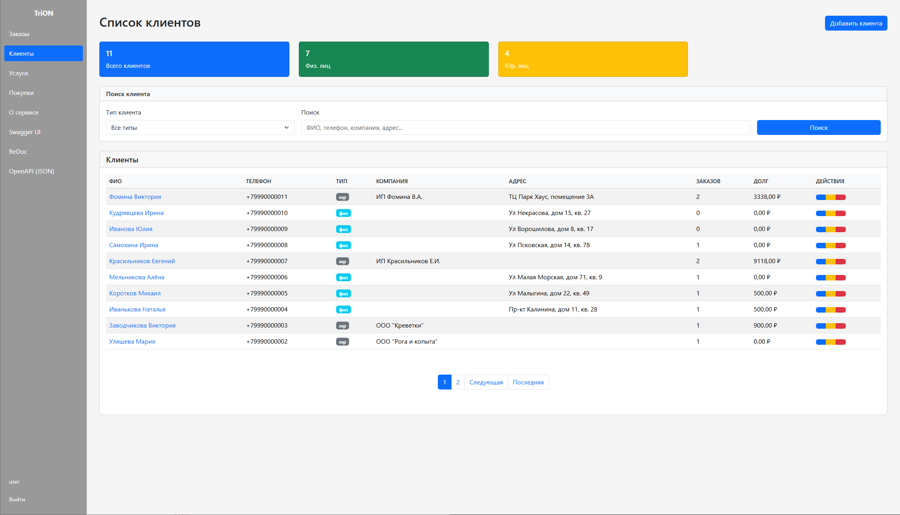
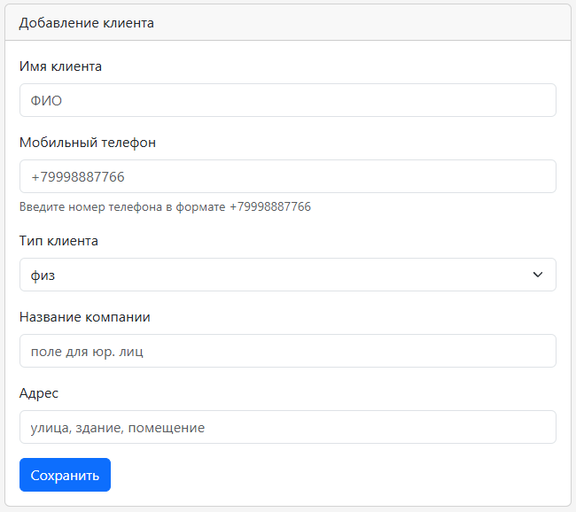
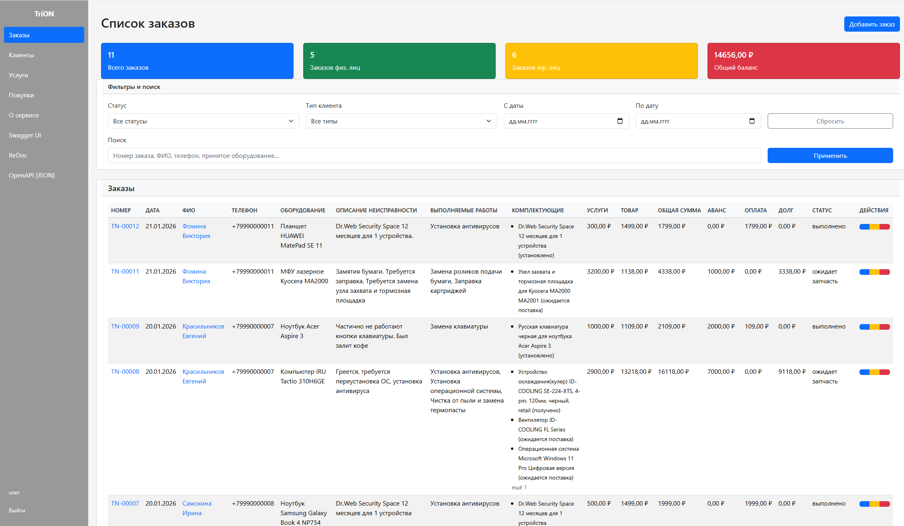
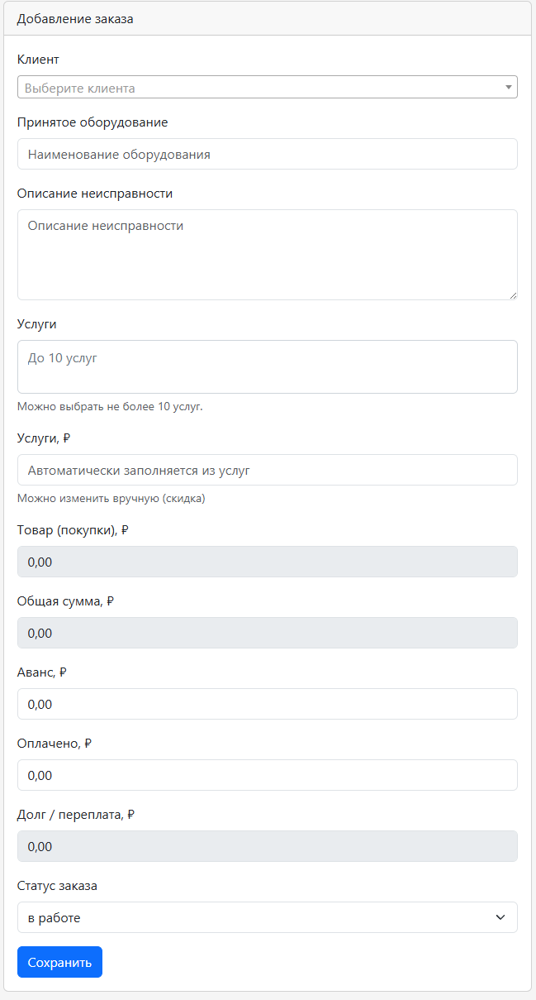
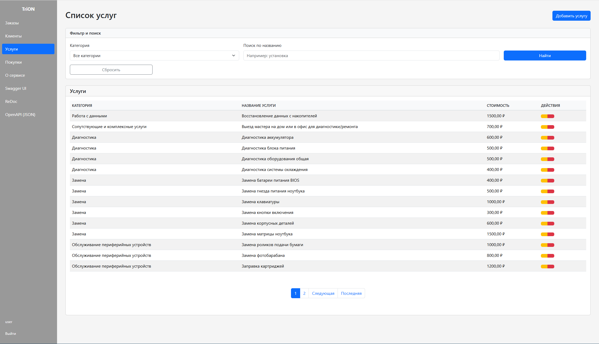
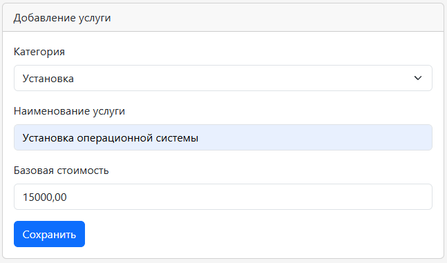
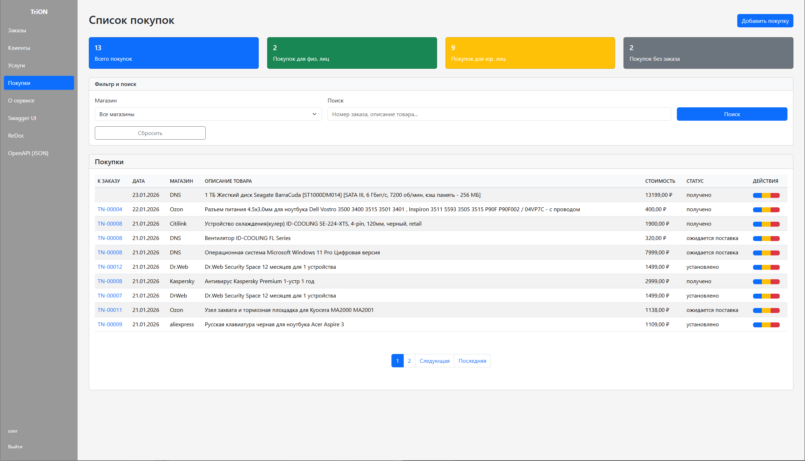
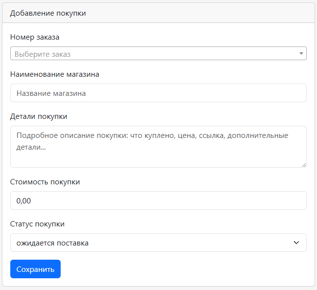
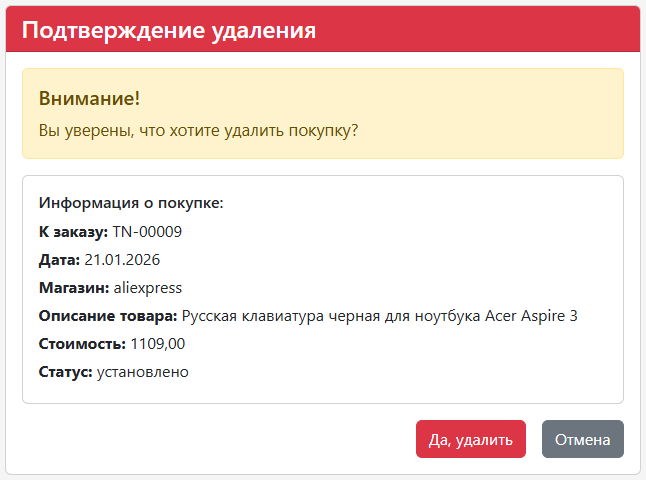
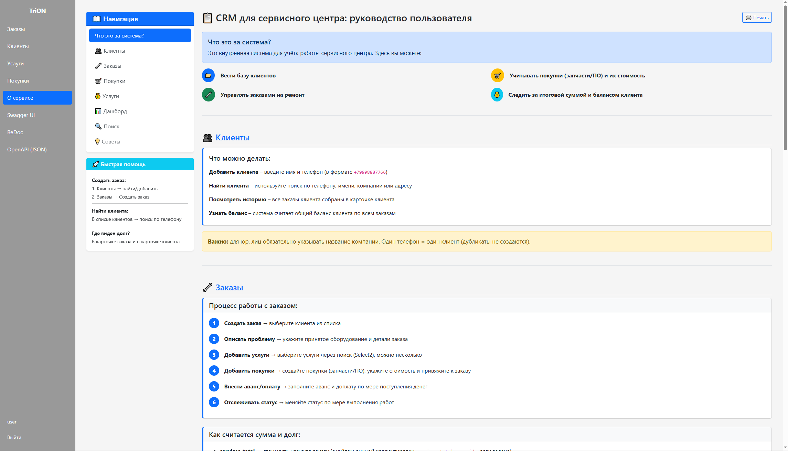

# Приложение `crm` (веб‑интерфейс CRM)

Приложение `crm` — основное Django‑приложение, реализующее веб‑интерфейс CRM‑системы для сервисного центра по ремонту техники.

Здесь находятся:

- доменные модели (клиенты, заказы, услуги, покупки);
- представления (ListView / DetailView / CRUD) и формы;
- HTML‑шаблоны (Django templates);
- административная панель Django.

---

## Структура приложения

Основные модули:

- [`models.py`](models.py) — модели `Client`, `Order`, `Service`, `Category`, `Purchase` и перечисления статусов.
- [`views.py`](views.py) — представления для клиентов, заказов, услуг, покупок и главной страницы.
- [`urls.py`](urls.py) — маршруты веб‑интерфейса (`/clients/`, `/orders/`, `/purchases/`, `/services/`, `/about/`, `/`).
- [`forms.py`](forms.py) — `ModelForm` для клиентов, заказов, услуг и покупок.
- [`base_views.py`](base_views.py) — общие базовые классы (List/Create/Update/Detail/Delete).
- [`mixins.py`](mixins.py), [`labels.py`](labels.py) — миксин для автоматических заголовков форм.
- [`validators.py`](validators.py) — валидация телефона и бизнес‑правило для юр. лиц.
- [`constants.py`](constants.py) — константы (длины полей, деньги, пагинация и т.д.).
- [`admin.py`](admin.py) — настройки административной панели Django.
- [`label.py`](label.py) — словарь меток моделей в родительном падеже для использования в шаблонах.

---

## Аутентификация

Веб-интерфейс CRM доступен **только авторизованным пользователям**
(`LoginRequiredMixin`).

В текущей конфигурации проекта оставлены только маршруты:

- `GET/POST /auth/login/` — вход
- `POST /auth/logout/` — выход

Функциональность страниц **сброса/восстановления пароля** через стандартные
Django-шаблоны (`password_reset_*`, `password_change_*`) отключена и в проекте
не используется.

---

## Маршруты и разделы интерфейса

Маршруты определены в [`urls.py`](urls.py).

### Главная страница (дашборд)

- `GET /` → `HomeView` (`TemplateView`, `crm/home_page.html`).

Контекст:

- `total_orders` — общее количество заказов.
- `total_clients` — общее количество клиентов.
- `active_orders_count` — количество **активных** заказов  
  (все, кроме `completed` и `not_relevant`).
- `total_duty` — суммарный баланс по всем заказам (`Order.objects.total_duty()`).
- `recent_orders` — список последних заказов (лимит `ORDERS_LIMIT_ON_HOMEPAGE`), с предзагруженными клиентами.


### Клиенты

Маршруты:

- `GET /clients/` → `ClientListView` — список клиентов
- `GET /clients/create/` → `ClientCreateView` — форма создания
- `POST /clients/create/` → `ClientCreateView` — создание
- `GET /clients/<id>/` → `ClientDetailView` — детальная карточка
- `GET /clients/<id>/edit/` → `ClientUpdateView` — форма редактирования
- `POST /clients/<id>/edit/` → `ClientUpdateView` — сохранение
- `GET /clients/<id>/delete/` → `ClientDeleteView` — подтверждение удаления
- `POST /clients/<id>/delete/` → `ClientDeleteView` — удаление

#### Список клиентов (`ClientListView`, `crm/clients/list.html`)

Функциональность:

- Пагинация через `BaseListView` (`QUANTITY_ON_PAGE` элементов на страницу).
- Сортировка по убыванию `id` (новые клиенты сверху).
- Фильтрация по типу клиента:
  - GET‑параметр `entity_type` (`FL` — физ., `UL` — юр.).
- Поиск (GET‑параметр `search`):
  - по имени (`client_name`),
  - по телефону (`mobile_phone`) — включая ввод только цифр,
  - по компании (`company`),
  - по адресу (`address`).

Статистика (агрегируется одним запросом в `get_context_data()`):

- `total_clients` — общее количество клиентов.
- `physical_count` — количество клиентов с `entity_type=FL`.
- `legal_count` — количество клиентов с `entity_type=UL`.

Дополнительный контекст:

- `entity_type_choices` — варианты типов клиента для `<select>`.
- `current_filters` — текущие значения фильтров (для сохранения состояния формы).

В таблице отображаются:

- ФИО клиента;
- телефон;
- тип (бейдж "физ" / "юр");
- компания;
- адрес;
- количество заказов клиента (`orders_count`);
- суммарный долг/переплата (`client.total_duty`);
- кнопки управления (просмотр / редактирование / удаление).



#### Создание / редактирование / удаление

- `ClientCreateView` / `ClientUpdateView` используют `ClientForm` и общий шаблон `crm/create.html`.
- После создания — редирект на `/clients/`.
- После редактирования — редирект на страницу просмотра клиента (`/clients/<id>/`).
- `ClientDeleteView` использует шаблон `crm/clients/delete.html` и после удаления редиректит на `/clients/`.

Форма `ClientForm`:

- валидирует телефон по маске `+7XXXXXXXXXX`;
- проверяет уникальность телефона (с пользовательским сообщением);
- бизнес‑правило “у юр. лиц `company` обязательно” реализовано на уровне модели и валидатора, так что правило едино и для веба, и для API.



---

### Заказы

Маршруты:

- `GET /orders/` → `OrderListView` — список заказов
- `GET /orders/create/` → `OrderCreateView` — форма создания заказа
- `POST /orders/create/` → `OrderCreateView` — создание заказа
- `GET /orders/<id>/` → `OrderDetailView` — детальная карточка заказа
- `GET /orders/<id>/edit/` → `OrderUpdateView` — форма редактирования заказа
- `POST /orders/<id>/edit/` → `OrderUpdateView` — сохранение изменений
- `GET /orders/<id>/delete/` → `OrderDeleteView` — страница подтверждения удаления
- `POST /orders/<id>/delete/` → `OrderDeleteView` — удаление заказа

#### Историчность цен на услуги (важно)

В проекте используется связующая модель `ServiceInOrder` (строки услуг заказа).  
Это позволяет фиксировать цену услуги **в момент добавления в заказ**:

- базовая цена услуги хранится в `Service.amount` (справочник);
- цена услуги в конкретном заказе хранится в `ServiceInOrder.amount`;
- если потом изменить `Service.amount`, старые заказы **не пересчитаются**.

#### Финансовая модель заказа

Для заказа считаются:

- `services_total` — стоимость услуг в заказе (с учётом возможной ручной коррекции `services_total_override`);
- `purchases_total` — сумма покупок (по `Purchase.cost`) привязанных к заказу;
- `total_amount = services_total + purchases_total` — итоговая сумма для клиента;
- `duty = total_amount - advance - paid` — баланс (долг/переплата).

#### Список заказов (`OrderListView`, `crm/orders/list.html`)

Базовый QuerySet оптимизирован:
- `select_related('client')`
- `prefetch_related('service_lines__service')`
- `prefetch_related('purchases')`

Фильтры:

- `status` — фильтрация по статусу (`OrderStatus`, поле `Order.status`).
- `entity_type` — тип клиента (`Client.entity_type`).
- `date_from`, `date_to` — фильтрация по дате создания (`create__date__gte/lte`).
- `search` — текстовый поиск:
  - по имени клиента,
  - по телефону клиента,
  - по принятому оборудованию,
  - по деталям заказа,
  - по номеру заказа (`number`, если из поисковой строки удаётся выделить цифры).

Статистика (в `get_context_data()`):

- `total_orders` — общее количество заказов.
- `physical_amount_order` — количество заказов клиентов‑физлиц.
- `legal_amount_order` — количество заказов клиентов‑юрлиц.
- `total_duty` — суммарный баланс по всем заказам (`Order.objects.total_duty()`).
- `status_choices` — список статусов заказа для фильтра.
- `entity_type_choices` — типы клиентов для фильтра.
- `current_filters` — текущие значения всех фильтров (status, entity_type, date_from, date_to, search).
- `status_stats` — словарь `{статус: количество заказов с этим статусом}`.

В таблице заказов отображаются:

- код заказа (`order.code`, например `TN-00001`);
- дата создания;
- ФИО клиента (ссылка на `client_detail`);
- телефон клиента;
- принятое оборудование;
- описание неисправности;
- услуги (через `order.service_lines`);
- стоимость услуг (`services_total`);
- стоимость покупок (`purchases_total`) 
- общая сумма для клиента (`total_amount`);
- аванс (`advance`);
- оплата (`paid`);
- долг/переплата (`duty`);
- статус (`get_status_display()`);
- действия (просмотр / редактирование / удаление).



#### Создание / редактирование / удаление

- `OrderCreateView` / `OrderUpdateView` используют `OrderForm` и общий шаблон `crm/create.html`.
- Поле выбора клиента — Select2 (`js-client-select`).
- Поле выбора услуг — Select2 (`js-services-select`) с поиском и лимитом выбора.
- Поле `services_total_override` ("Стоимость услуг") можно вручную скорректировать (скидка/коррекция стоимости услуг).
- После создания — редирект на `/orders/`.
- После редактирования — редирект на страницу просмотра заказа (`/orders/<id>/`).
- `OrderDeleteView` использует шаблон `crm/orders/delete.html` и после удаления редиректит на `/orders/`.



---
### Услуги

Раздел предназначен для ведения справочника услуг сервисного центра. Услуги используются в заказах и влияют на расчёт `services_total`.

Маршруты:

- `GET /services/` → `ServiceListView` — список услуг
- `GET /services/create/` → `ServiceCreateView` — форма создания услуги
- `POST /services/create/` → `ServiceCreateView` — создание услуги
- `GET /services/<id>/edit/` → `ServiceUpdateView` — форма редактирования услуги
- `POST /services/<id>/edit/` → `ServiceUpdateView` — сохранение изменений
- `GET /services/<id>/delete/` → `ServiceDeleteView` — подтверждение удаления
- `POST /services/<id>/delete/` → `ServiceDeleteView` — удаление

Возможности:

- просмотр списка услуг с указанием категории и стоимости;
- фильтр по категории и поиск по названию услуги в пользовательском интерфейсе;
- создание/редактирование услуг через `ServiceForm`;
- защита от удаления услуги, которая используется в заказах (обрабатывается `ProtectedError`).



#### Категории услуг

Категории создаются в админке Django и используются для группировки услуг.
У категории есть:
- `title` — название
- `slug` — уникальный идентификатор (удобен для фильтрации).

#### Использование услуг в заказах

В заказе можно выбрать набор услуг (выполненные работы). На основе выбранных услуг:
- фиксируется стоимость каждой услуги в заказе (`ServiceInOrder.amount`);
- рассчитывается `services_total` (с учётом `services_total_override`, если задан).

#### Создание / редактирование / удаление

- `GET /services/create/` → `ServiceCreateView` — форма создания
- `GET /services/<id>/edit/` → `ServiceUpdateView` — форма редактирования

Форма (`ServiceForm`) позволяет:
- выбрать **категорию** услуги;
- задать **уникальное имя** услуги;
- указать **базовую стоимость** (decimal).

Валидация:
- `service_name` уникально (при попытке создать дубликат будет ошибка).



Удаление:
- выполняется через страницу подтверждения (`GET`) и подтверждение (`POST`);
- если услуга **используется в заказах**, удаление невозможно (срабатывает
  `ProtectedError` из‑за `on_delete=PROTECT` в `ServiceInOrder`), пользователю
  выводится сообщение об ошибке и выполняется редирект на список услуг.

---

### Покупки (запчасти / ПО)

Маршруты:

- `GET /purchases/` → `PurchaseListView` — список покупок
- `GET /purchases/create/` → `PurchaseCreateView` — форма создания покупки
- `POST /purchases/create/` → `PurchaseCreateView` — создание покупки
- `GET /purchases/<id>/` → `PurchaseDetailView` — детальная карточка покупки
- `GET /purchases/<id>/edit/` → `PurchaseUpdateView` — форма редактирования
- `POST /purchases/<id>/edit/` → `PurchaseUpdateView` — сохранение изменений
- `GET /purchases/<id>/delete/` → `PurchaseDeleteView` — подтверждение удаления
- `POST /purchases/<id>/delete/` → `PurchaseDeleteView` — удаление

Возможности:
- покупка может быть привязана к заказу или быть “без заказа”;
- хранится магазин, описание и **стоимость покупки** (`cost`);
- установка статуса покупки (ожидается поставка / получено / установлено);
- фильтр по магазину и поиск по деталям покупки и номеру заказа;
- просмотр списка покупок и детальной карточки;
- редактирование и удаление записи.

#### Список покупок (`PurchaseListView`, `crm/purchases/list.html`)

- Базовый QuerySet: `Purchase.objects.select_related('order__client')`.
- Пагинация через `BaseListView`.

Фильтры/поиск:
- фильтр по магазину (`store`);
- поиск по деталям покупки (`detail`) и по номеру заказа (`order__number`).

Статистика (по текущей выборке):
- `total_purchases` — общее количество покупок;
- `physical_amount_purchase` — покупок по заказам клиентов‑физ.лиц;
- `legal_amount_purchase` — покупок по заказам клиентов‑юр.лиц;
- `without_order_purchase` — покупок без привязки к заказу.



#### Создание / редактирование / удаление

- `PurchaseCreateView` / `PurchaseUpdateView` используют `PurchaseForm`.
- Поле выбора заказа использует Select2 (`js-order-select`) для удобного поиска по списку заказов.
- После сохранения — редирект на `/purchases/` или `/purchases/<id>/` (для обновления).
- `PurchaseDeleteView` использует шаблон `crm/purchases/delete.html` и после удаления редиректит на `/purchases/`.



`PurchaseForm`:
- поля: заказ (опционально), магазин, детали покупки, стоимость (`cost`), статус.



---
### Страница "О сервисе" / руководство пользователя

- URL: `GET /about/`
- Доступ: только авторизованным пользователям
- Содержит: описание разделов CRM, статусов заказов и покупок, подсказки по работе



---

## Пагинация

Все списки используют общий include:

- `templates/includes/paginator.html`

Пагинация:
- по умолчанию `QUANTITY_ON_PAGE` элементов на страницу (через `BaseListView`);
- для услуг используется отдельный лимит `SERVICES_LIMIT_ON_PAGE`.

---

## Базовые представления и заголовки форм

В [`base_views.py`](base_views.py):

- `BaseListView(LoginRequiredMixin, ListView)` — общий класс для всех списков (пагинация).
- `BaseCreateView` / `BaseUpdateView`:
  - добавляют сообщения об успехе (`SuccessMessageMixin`);
  - используют общий шаблон `crm/create.html`;
  - через `NameContextMixin` прокидывают в шаблон переменную `name` (родительный падеж: "клиента", "заказа" и т.д.), чтобы заголовки форм строились автоматически.
- `BaseDetailView` / `BaseDeleteView` — общие базовые классы просмотра и удаления с `LoginRequiredMixin`.

В [`mixins.py`](mixins.py) и [`labels.py`](labels.py):

- `GENITIVE_LABELS` — словарь:
  - `Client: 'клиента'`,
  - `Order: 'заказа'`,
  - `Service: 'услуги'`,
  - `Purchase: 'покупки'`.
- `NameContextMixin.get_context_data()` по модели вьюхи (или форме) находит правильную подпись и кладёт её в контекст как `name`.

Пример использования в шаблоне `crm/create.html`:

```django
<h1>Создание {{ name }}</h1>
```