# Telegram‑бот для CRM

Модуль `telegram_bot` — Telegram‑бот, работающий поверх **read‑only REST API**.  
Бот позволяет просматривать информацию о клиентах, заказах и покупках запчастей/программного обеспечения прямо из Telegram.

Используется библиотека **pyTelegramBotAPI** (`telebot`).

---

## Возможности бота

Функциональность реализована в `handlers_*.py` и `bot.py`.

### Авторизация и доступ

- Команда **`/start`**:
  - проверяет, разрешён ли `chat_id` (`TELEGRAM_ALLOWED_CHAT_IDS`);
  - если пользователь ещё не авторизован в CRM:
    - показывает кнопку **«Авторизация»**;
  - если авторизация уже есть:
    - сразу показывает кнопку **«Меню»**.

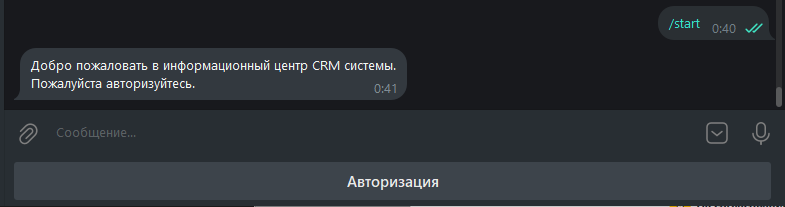

- Кнопка **«Авторизация»**:
  - по шагам запрашивает:
    1. логин (`username`);
    2. пароль;
  - затем вызывает `get_tokens(username, password)`:
    - `POST {API_BASE_URL}/api/auth/jwt/create/` (Djoser JWT),
    - ожидает `{"access": "<ACCESS>", "refresh": "<REFRESH>"}`;
  - при успехе:
    - создаётся `CRMClient(access, refresh)` и сохраняется в `sessions[chat_id]`;
    - показывается клавиатура с кнопкой **«Меню»**;

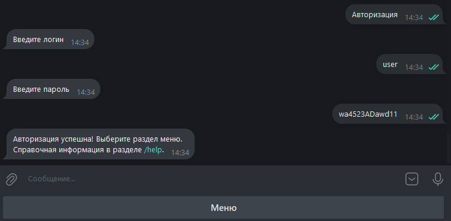

  - при ошибке логин/пароль:
    - сообщение *«Неверный логин или пароль»*;
    - состояние авторизации очищается.

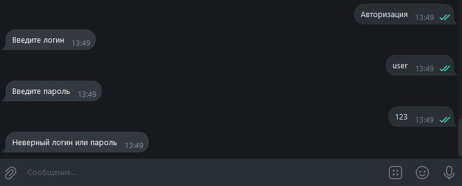

- Ограничение по `chat_id`:
  - если `TELEGRAM_ALLOWED_CHAT_IDS` пустой — бот доступен всем;
  - если задан список ID — только эти chat_id имеют доступ; остальные получают сообщение *«Доступ к этому боту ограничен.»*.

### Главное меню

После успешной авторизации доступна кнопка **«Меню»**, которая открывает главное меню:

- **Клиенты**
- **Заказы**
- **Покупки**

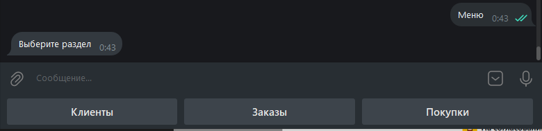

Команда **`/help`** отправляет справочный текст `HELP_TEXT`:

- как запустить бота;
- как авторизоваться;
- что делают разделы «Клиенты», «Заказы», «Покупки»;
- какие фильтры доступны.

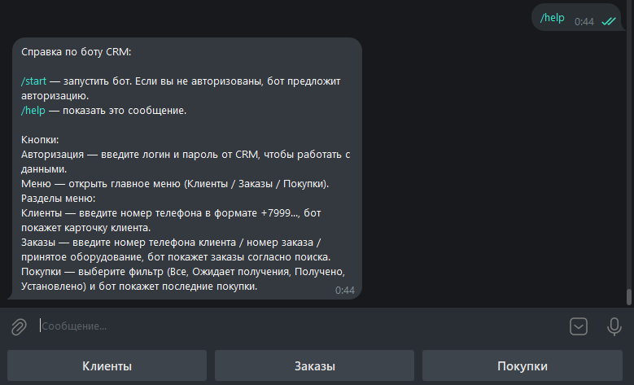
---

## Взаимодействие с CRM API

Реализовано в `crm_client.py`.

### Получение токенов

```python
from telegram_bot.crm_client import get_tokens

tokens = get_tokens(username, password)
# делает POST {API_BASE_URL}/api/auth/jwt/create/
# возвращает словарь {'access': '...', 'refresh': '...'}
```

Ожидается, что backend настроен на Djoser JWT (/api/auth/jwt/create/, /api/auth/jwt/refresh/).

## Класс CRMClient

```python
client = CRMClient(access, refresh, base_url=API_BASE_URL)
```
- хранит access_token и refresh_token;
- использует requests.Session с заголовком `Authorization: Bearer <access>`.

Все HTTP‑запросы идут через `_request()`:

1. делает запрос `session.request(method, url, **kwargs)`;
2. если ответ `401 Unauthorized`
   - вызывает `_refresh()`:
      - `POST /api/auth/jwt/refresh/` с `{"refresh": "<token>"}`;
      - при 401 выбрасывает `RefreshTokenInvalidError`;
      - иначе обновляет `access_token` и заголовок `Authorization`;
   - повторяет запрос ещё раз;
3. при других ошибках `response.raise_for_status()` выбрасывает `HTTPError`.

Метод `_extract_results()` позволяет одинаково работать с ответами:
- `[{...}, {...}]`
- `{ "results": [ {...}, ... ], "count": ... }`

Основные методы:

- `get_clients(search=None)` → `GET /api/clients/?search=...`
- `get_client(client_id)` → `GET /api/clients/{id}/`
- `get_orders(status=None, search=None, ordering=None)` → `GET /api/orders/`
- `get_order(order_id)` → `GET /api/orders/{id}/`
- `get_purchases(status=None, search=None, ordering=None)` → `GET /api/purchases/`
- `get_purchase(purchase_id)` → `GET /api/purchases/{id}/`

В хендлерах все вызовы CRM клиента обёрнуты в функцию `call_api_or_error(chat_id, func, ...)`, которая:

- логирует HTTP/сетевые ошибки;
- отправляет пользователю понятное сообщение:
  - Ошибка при обращении к API.» или
  - «API временно недоступно, попробуйте позже.»

---

## Структура клавиатур

Определена в keyboards.py (`ReplyKeyboardMarkup`).

- `start_keyboard(is_authorized)`
  - неавторизован: «Авторизация»;
  - авторизован: «Меню».
- `menu_only_keyboard()`
  - только «Меню» (после успешной авторизации).
- `main_menu_keyboard()`
  - Клиенты / Заказы / Покупки.
- `clients_keyboard()`
  - Меню / Авторизация — внутри раздела «Клиенты».
- `orders_menu_keyboard()`
  - Поиск / Выбор статуса (рядом),
  - ниже Меню / Авторизация.
- `orders_search_keyboard()`
  - Меню / Авторизация во время ввода поисковой строки.
- `orders_status_keyboard()`
  - кнопки статусов заказов (читаемый текст из `ORDER_STATUS_TEXT_TO_CODE`),
  - ниже Меню / Авторизация.
- `purchases_menu_keyboard()`
  - Все покупки / Ожидается поставка / Получено / Установлено,
  - ниже Меню / Авторизация.

---

## Раздел «Клиенты»

Код: `handlers_clients.py`.

### Вход в раздел

- Кнопка «Клиенты»:
  - проверка CRM‑сессии (`get_crm_or_ask_auth`);
  - сброс диалоговых состояний (`clear_dialog_states`);
  - установка `clients_state[chat_id]['stage'] = 'await_phone'`;
  - сообщение:
    > `Введите номер телефона клиента (в формате +7999...).`
  - клавиатура `clients_keyboard()` (Меню / Авторизация). 

### Поиск по телефону

- В состоянии `await_phone`:
  - служебные кнопки (`Меню`, `Авторизация`, `Клиенты`, `Заказы`, `Покупки`) игнорируются;
  - текст сообщения → номер телефона (например, `+79995556677`);
  - через `crm.get_clients(search=phone)` бот получает список клиентов;
  - если список пуст:
    - сообщение: «Клиенты по текущей информации отсутствуют»;
    - показ основного меню;
  - если найден клиент:
    - берётся первый объект;
    - формируется карточка:
      - ФИО
      - Телефон
      - Тип (по `ENTITY_LABELS`: `FL → "физ"`, `UL → "юр"`)
      - Компания (или `-`, если пусто)
      - Адрес (или `-`)
    - сообщение отправляется пользователю;
    - показывается главное меню.
- В `finally` состояние `clients_state[chat_id]` очищается.


---

## Раздел «Заказы»

Код: `handlers_orders.py` + общие хелперы в `bot.py`.

**Вход в разде

- Кнопка «Заказы»:
  - проверяет авторизацию;
  - сбрасывает состояния;
  - ставит `orders_state[chat_id]['stage'] = 'orders_menu'`;
  - отправляет сообщение:
    > `Выберите действие для заказов:`
  - клавиатура `orders_menu_keyboard()`:
    - верхний ряд: Поиск / Выбор статуса
    - нижний: Меню / Авторизация.

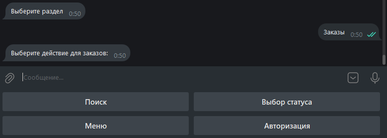

### Поиск заказов по строке

1. Кнопка «Поиск»:
   -  `stage = 'await_search'`;
   -  сообщение‑подсказка:
      -  можно искать по:
         -  номеру телефона клиента (`+7999...`);
         -  номеру заказа (например, `TN-00101`);
         -  наименованию оборудования (например, `Asus ROG`);
      - клавиатура `orders_search_keyboard()`.
2. В состоянии `await_search`:
 - игнорируются служебные кнопки;
 - текст → `query`;
 - вызывается `crm.get_orders(search=query)`;
 - если список пуст:
   - сообщение: «Заказы по текущей информации отсутствуют»;
   - главное меню;
 - если есть заказы:
   - `send_orders_list(chat_id, orders)`:
     - берёт до `MAX_ORDERS_SHOWN` заказов;
     - каждый заказ форматируется функцией `format_order_message(order)` в `bot.py`:
       - Номер заказа (код, например `TN-00010`);
       - ФИО;
       - Дата (через `format_iso_date`);
       - Оборудование;
       - Описание неисправности;
       - Список услуг;
       - Список компонентов;
       - Стоимость услуг (`services_total`);
       - Стоимость товара (`purchases_total`);
       - Общая сумма (`total_amount`)
       - Аванс (`advance`);
       - Оплата (`paid`)
       - Долг клиента (`duty`);
       - Статус (переведён через `ORDER_STATUS_LABELS` в человекочитаемый вид);
     - после списка снова показывается главное меню.
 - в `finally` `orders_state[chat_id]` очищается.

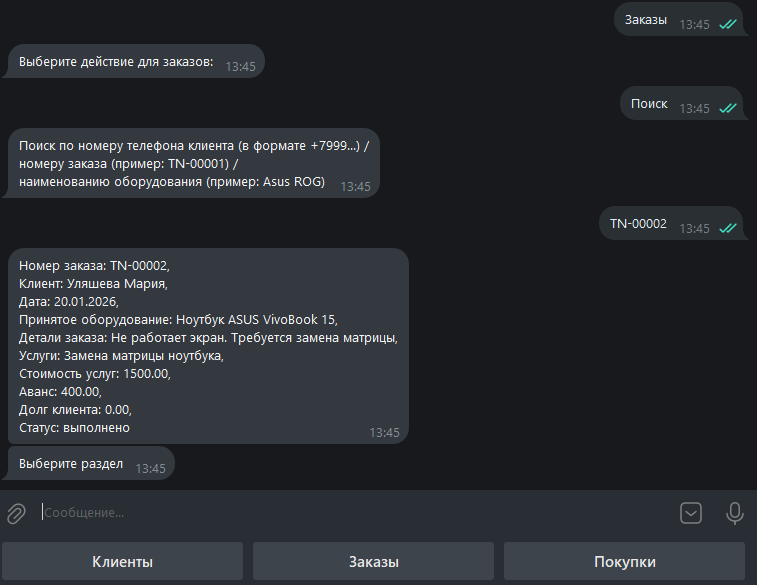


### Фильтр заказов по статусу

1. Кнопка «Выбор статуса»:
    - `stage = 'await_status'`;
    - сообщение: «Выберите статус заказов»;
    - клавиатура `orders_status_keyboard()`:
      - набор кнопок статусов (например, «В работе», «Ожидает запчасть», «Готово к выдаче», ...),
      - плюс Меню / Авторизация.
2. В состоянии `await_status`:  
    - если текст нажатой кнопки есть в `ORDER_STATUS_TEXT_TO_CODE`:
      - текст → код статуса (например, "В работе" → "in_working");
      - из `sessions[chat_id]` берётся CRM‑клиент;
      - вызывается `crm.get_orders(status=status_code)`;
      - если сессии нет:
        - сообщение: «Сессия авторизации потеряна, залогиньтесь ещё раз.»;
      - если заказов нет:
        - сообщение: «Заказы со статусом "<текст>" отсутствуют»;
        - главное меню;
      - если есть — `send_orders_list(chat_id, orders)` (как при поиске).
    - в `finally` `orders_state[chat_id]` очищается.

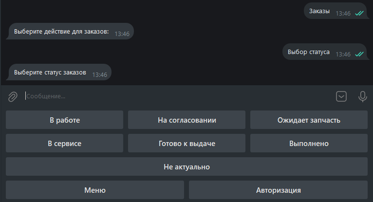

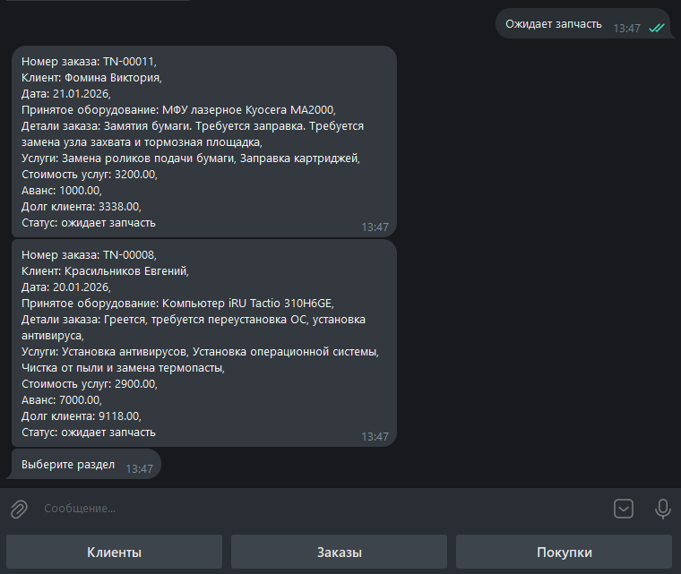

---

## Раздел «Покупки»

Код: `handlers_purchases.py` + `send_purchases` в `bot.py`.

### Вход в раздел

- Кнопка «Покупки»:
  - проверка авторизации;
  - сброс состояний;
  - сообщение:
    > "Выберите фильтр по покупкам"
  - клавиатура `purchases_menu_keyboard()`:
    - Все покупки
    - Ожидается поставка
    - Получено
    - Установлено
    - Меню / Авторизация

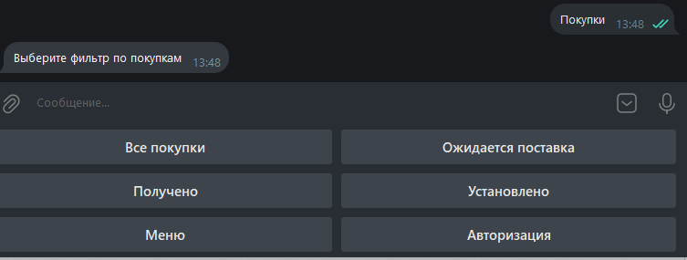

### Фильтры покупок

Четыре кнопки:

- «Все покупки» → `send_purchases(chat_id, status=None)`
- «Ожидается поставка» → `send_purchases(chat_id, status='delivery_expected')`
- «Получено» → `send_purchases(chat_id, status='received')`
- «Установлено» → `send_purchases(chat_id, status='installed')`

`send_purchases`:

- через `get_crm_or_ask_auth` проверяет авторизацию;
- через `call_api_or_error(chat_id, crm.get_purchases, status=status)` получает покупки;
- если нет данных:
  - при `status=None`: «Покупок не найдено»;
  - при конкретном статусе: «Покупки со статусом <текст> отсутствуют» + главное меню;
- если есть данные:
  - берёт до `MAX_PURCHASES_SHOWN` покупок;
  - для каждой формирует сообщение:
    - Код заказа (`order_code`) или `-`;
    - Дата (`create` → `DD.MM.YYYY`);
    - Магазин (`store`);
    - Описание товара (`detail`);
    - Стиомость (`cost`);
    - Статус (по `PURCHASE_STATUS_LABELS`).
  
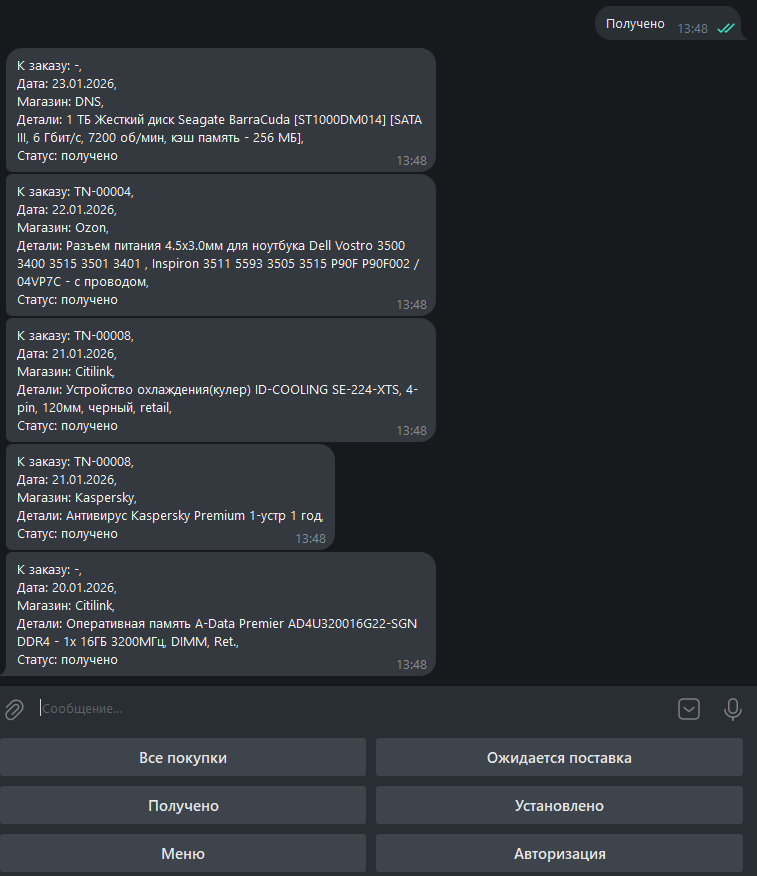

---

## Переменные окружения

```
# Основные переменные для бота
TELEGRAM_BOT_TOKEN=***      # токен бота от BotFather

# Разрешённые chat_id (если пусто — бот доступен всем)
TELEGRAM_ALLOWED_CHAT_IDS=1234567

# Базовый URL API CRM:
# - при запуске бота в docker-compose (в одной сети с backend):
API_BASE_URL=http://backend:8000
# - при локальном запуске бота против dev-сервера:
# API_BASE_URL=http://127.0.0.1:8000
```

Остальные переменные (DJANGO_ALLOWED_HOSTS, POSTGRES_* и т.п.) относятся к backend‑службе Django и описаны в README backend’а.

## Логирование

Настроено в logger.py:

- каталог логов: backend/logs/ (создаётся автоматически);
- основной файл: backend/logs/main.log;
- используется RotatingFileHandler:
  - максимум 50 МБ на файл (maxBytes=50_000_000);
  - до 3 резервных файлов (backupCount=3);
- формат строки лога:
    `YYYY-MM-DD HH:MM:SS - telegram_bot - LEVEL - message`

Логи также дублируются в консоль (StreamHandler).

Через logger пишутся:

- попытки и результаты авторизации;
- HTTP/Connection ошибки при обращении к API CRM;
- проблемы с refresh‑токеном и доступом по chat_id.

---

## Запуск бота

1. Локальный запуск (без Docker)

Из каталога backend:

```Bash
python -m telegram_bot.main
```
Перед этим должен быть запущен backend (Django dev‑server или gunicorn), и API_BASE_URL должен указывать на него, например:

```env
API_BASE_URL=http://127.0.0.1:8000
```

2. Запуск в Docker Compose

В docker-compose.yml сервис бота выглядит так:

```yaml
bot:
build: ./backend/
env_file: ./backend/.env
depends_on:
  - backend
command: ["python", "-m", "telegram_bot.main"]
restart: unless-stopped
```

Команда запуска всего стека из корня проекта (trion-crm):

```bash
docker compose up --build
```

При этом:

- backend доступен как сервис backend на порту 8000 внутри сети compose;

- в .env для бота должно быть:

```env
API_BASE_URL=http://backend:8000
TELEGRAM_BOT_TOKEN=***
TELEGRAM_ALLOWED_CHAT_IDS=12345678
```

Перед запуском убедитесь, что:

1. Backend CRM запущен

  - Применены миграции, создан пользователь bot (или другой, которым логинится бот).
  - Работают эндпоинты:
    - `POST /api/auth/jwt/create/`, `POST /api/auth/jwt/refresh/`
    - `GET /api/clients/?search=+7999...`
    - `GET /api/orders/`, `GET /api/purchases/`

2. Переменные окружения бота заданы

Обязательно:
  - TELEGRAM_BOT_TOKEN=***
  - API_BASE_URL=
    - локально: http://127.0.0.1:8000
    - в docker-compose: http://backend:8000
Опционально:
- TELEGRAM_ALLOWED_CHAT_IDS=1234567